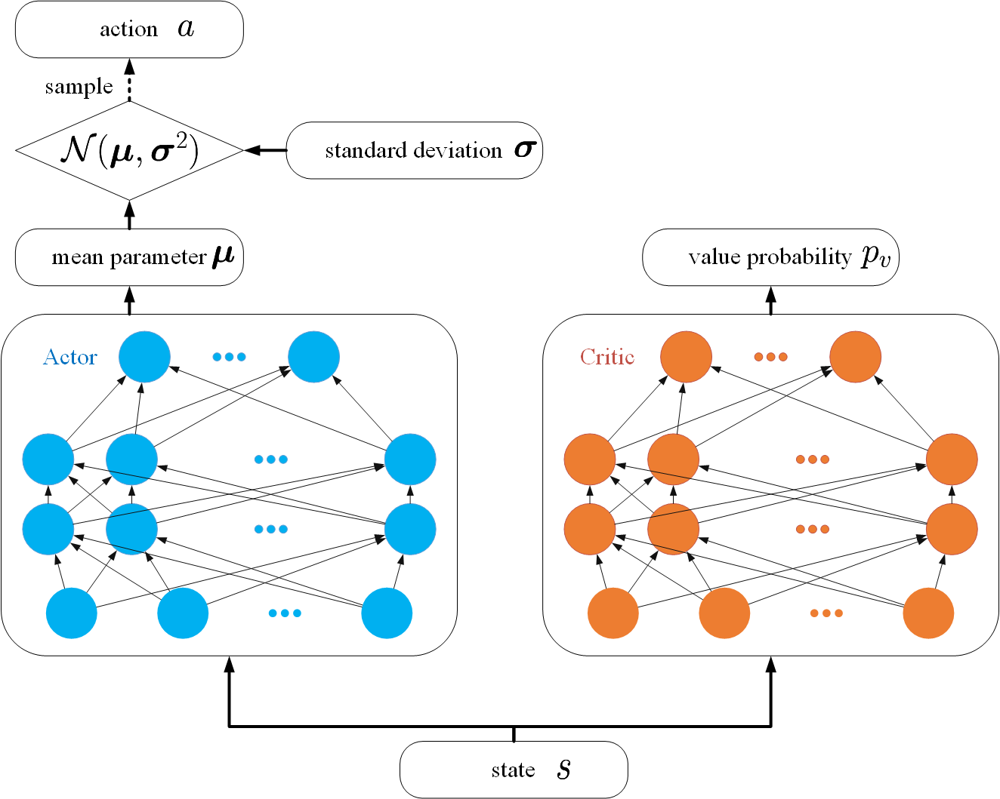
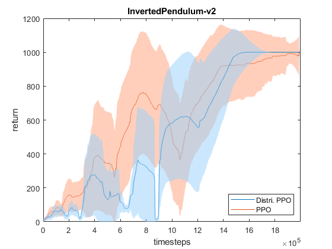
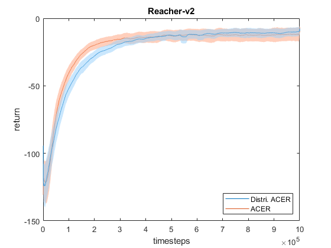

# Distributional Policy Optimization for Multi-Goal Reinforcement Learning


In this respository, we implmented our proposed distributional policy optimization model for continuous control tasks. Environments where we evaluated can be find in **Experimental Settings** section.  

Our distributional policy optimization model consists of an actor network and a **distributional** value network. This is an actor critic structure but with a different alogrithm to optimize. Our algorithm is adopted to estimate the value distribution or the distribution of the sum of discounted rewards where the algorithm is under an actor critic structure to deal with robotic control problems. We present a distributional policy optimization where a trajectory is taken into account to carry out the value distribution for policy optimization. We also compare the result with other algorithms like proximal policy optimization (PPO) and actor critic experience replay (ACER).

# Preliminary
- python 3
  - numpy
  - scipy
    - to store **.mat** file
  - pytorch
    - to train model
  - OpenAI baselines
    - for parallel enviroment
  - OpenAI gym
    - enviroment 
  - mujoco
    - The preliminary of gym for continuous control
  - sacred
    - hyperparameter management
  
# How to train the model
Simply train the model by typing the following command
```
$ python train.py
```
in this dictionary.
If you want to change the setting for the model, you can directly edit the configuration file
```
./common/config.py
```
or you can use the experimental setting in configuration dictionary like
```
$ python train.py with ./config/InvertedPendulum-v2/DPPO.json
```
We recommand you to write your own configuration file to train the model if you want to change the setting.
```
$ python train.py with /path/to/your/config/file.json
```
You can print the setting by using the following comand.
```
$ python train.py print_config with /path/to/your/config/file.json
```
# How to test the model
Simply test the model typing the command
```
$ python test.py with /path/to/your/config/file.json
```
in this dictionary. It wiil report the statistics of return over 100 epoch. 

# Experimental Settings
- Framework
    - python 3.5.2
    - pytorch 1.0.0
    - numpy 1.15.4
    - scipy 1.2.0
    - sacried 0.7.4
    - baselines git@f7fcc80
    - gym git@f6ff898
    - mujoco-py git@f7b4191

- Hardware
    - CPU: Intel Core i7-7700 @3.60 GHz
    - RAM: DDR3 2400MHz 64GB
    - GPU: Geforce GTX 1080Ti, Geforce GTX 980 
    - CUDA Version: 9.0.176
    - CuDNN Version: 7.1.2
- Environment
  - InvertedPendulum-v2
  - Reacher-v2
# Experimental Result
## On-policy comparasion in inverted pendulum
The reward curve is smoothed by averaging the returns of recent 500 episodes with one standard deviation shaded area. And the final performance statistics of return over 100 epoch.

Algorithm  |    min|    max| median | mean std
:----------|------:|------:|---------:|----------:
PPO        |377.00 |1000.00| 1000.00  |989.98\\(\pm\\)72.23
Distri. PPO|1000.00|1000.00| 1000.00  |1000.00\\(\pm\\)0.00
## Off-policy comparasion in reacher
The reward curve is smoothed by averaging the returns of recent 500 episodes with one standard deviation shaded area. And the final performance statistics of return over 100 epoch.

Algorithm   |    min|    max| median   | mean std  
:-----------|------:|------:|---------:|----------:
ACER        |-21.01 |-2.02  | -10.33   |-11.02\\(\pm\\)4.67
Distri. ACER|-16.28 |-3.47  | -9.67    |-9.79\\(\pm\\)3.10 
